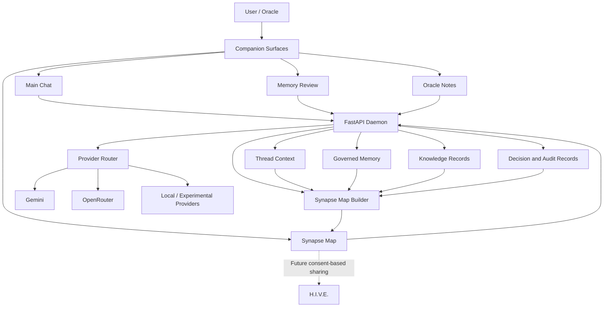
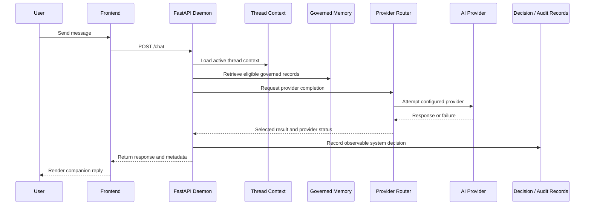
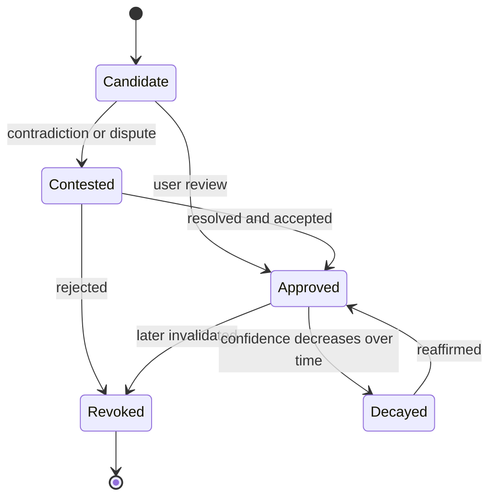

# Technemachina

**A local-first AI companion and research architecture for governed memory, auditable decision traces, provider routing, and personal knowledge constellations.**

Technemachina explores a different model of persistent AI: one in which memory is not silently accumulated and treated as truth, but proposed, reviewed, traced, contested, approved, revoked, or allowed to decay under user authority.

Its central design question is:

> What would an AI system look like if persistent knowledge had to earn admission?

Technemachina combines a FastAPI daemon, provider-aware AI routing, governed memory, thread context, decision and audit records, and the **Synapse Map**—a personal visual interface for inspecting relationships among projects, memories, knowledge, reviews, decisions, threads, doctrine, and milestones.

> **The renderer is shared. The living constellation belongs to the user.**

---

## Why Technemachina Exists

Most AI systems optimize for immediate response quality and convenient recall. Persistent context is often hidden, difficult to inspect, or treated as an implementation detail.

Technemachina treats persistent state as an epistemic and governance problem.

The architecture is designed around four principles:

1. **Local control**  
   The daemon, state, logs, and interface run locally by default.

2. **Governed memory**  
   Candidate information is distinguishable from approved memory. Provenance, confidence, review state, and contradiction handling are intended to remain visible.

3. **Auditable operation**  
   Provider attempts, failures, routing decisions, memory actions, and system state can be recorded and inspected.

4. **User authority**  
   The companion may assist, recommend, organize, and explain, but the user remains the authority over durable memory and privileged action.

Technemachina does **not** expose a model's private hidden chain of thought. It focuses instead on inspectable system artifacts: persistent context, provenance, confidence, provider routing, retrieval paths, decision traces, permissions, contradictions, reviews, and governance history.

---

## Architecture

Technemachina currently consists of four connected layers.

### Governed Memory

The scientific core of the architecture.

The intended memory lifecycle includes:

- Candidate
- Contested
- Approved
- Revoked
- Decayed

Memory records can carry confidence, provenance, taxonomy, review history, and links to the threads or knowledge sources from which they emerged.

### Companion

The continuous interaction layer.

The companion is intended to remain coherent across multiple surfaces:

- Main chat
- Synapse companion console
- Selected-signal detail surfaces
- Oracle Notes
- Memory and governance review
- Future H.I.V.E. and voice surfaces

The companion is advisory around durable memory unless the user explicitly approves a change.

### Synapse

The personal visual interface.

Synapse renders real daemon objects and relationships as a navigable constellation. Nodes may represent memory records, knowledge records, sources, candidates, reviews, decisions, threads, project doctrine, and milestones.

Synapse is designed as a read-oriented perception and inspection surface. Rendering or analyzing the map does not itself approve, rewrite, or delete memory.

### H.I.V.E.

A future consent-based collaboration layer.

H.I.V.E. is intended to allow selected project intelligence to be shared across users or installations without collapsing each person's private Synapse into a universal public graph.

Synapse represents the private self. H.I.V.E. represents intentional connection.

---

## System Overview



---

## Request Flow



---

## Current Status

Technemachina is active research software. It is not yet a polished consumer application.

### Implemented

- FastAPI local daemon
- Browser-based local frontend
- Thread registry and persistent thread context
- Provider-aware routing
- Gemini integration
- Optional OpenRouter integration
- Provider health and status reporting
- Restriction-aware failover behavior
- Memory candidate pipeline
- Governed memory records and review structures
- Knowledge candidates, records, and sources
- Decision and audit-oriented records
- Read-only Synapse Map endpoint
- Synapse analysis endpoint
- Constellation renderer and renderer registry
- Synapse data adapter
- Map diagnostics through `scripts/synapse_doctor.py`
- Portable project-root resolution
- Project-local `.env` loading
- Service-readiness checks before diagnostics
- Clean shutdown of backend and frontend from the launcher

### In Active Development

- Companion integration across every interface
- Selected-signal explanations and long descriptions
- Natural-language Synapse navigation and layout control
- Memory conflict detection and coexistence handling
- Confidence decay and time-aware review
- Stronger provenance-chain inspection
- Permission-scoped tool execution
- Risk-tiered local automation
- Sandboxed code execution
- Public documentation and reproducibility tests
- Formal evaluation of governed-memory claims

### Future Research Direction

- Consent-based H.I.V.E. collaboration
- Shared project constellations
- Voice presence
- Multi-user governance
- Formal memory-state transition rules
- Reproducible research benchmarks
- External plugin and tool contracts
- Comparative studies against conventional retrieval and memory systems

---

## Public Baseline and Private Living State

A clean checkout currently reconstructs the verified **public reproducible baseline**:

- **231 nodes**
- **657 edges**

The private recovered living installation contains:

- **257 nodes**
- **675 edges**

The additional private nodes and relationships come from local runtime state, including:

- Threads
- Thread candidates
- Memory records and layers
- Review items and decisions
- Knowledge candidates and records
- Knowledge sources
- Governance relationships

These values describe two verified states, not universal fixed limits. A user's constellation can grow or change as that installation accumulates its own governed projects, conversations, documents, decisions, and experiences.

Private runtime records, API credentials, and personal living-state data are intentionally excluded from the public repository baseline.

> **The renderer is shared. The living constellation belongs to the user.**

---

## Repository Structure

```text
Technemachina-Daemon-v0.1/
├── daemon/                         FastAPI backend and local state systems
│   ├── app.py                      Main API application
│   ├── providers/                  Provider integrations
│   ├── logs/                       Runtime-generated logs and governed state
│   ├── runtime_context/            Runtime-generated local context
│   ├── synapse_map.py              Synapse graph construction
│   └── synapse_analysis.py         Read-only graph analysis
├── frontend/                       Local browser interface
│   ├── index.html
│   ├── main.js
│   ├── style.css
│   └── synapse/                    Renderer and interface modules
├── scripts/
│   └── synapse_doctor.py           Synapse data-path diagnostic
├── docs/                           Doctrine, specifications, and milestones
├── env_loader.py                   Project-local environment loader
├── launch_technemachina.py         Standard launcher
├── clean_launch_technemachina.py   Recovery launcher with port cleanup
├── .env.example                    Credential-variable template
└── README.md
```

Runtime-generated directories and private-state files may be absent in a fresh checkout and are created or populated locally as the system runs.

---

## Requirements

Verified development environment:

- macOS
- Python **3.13.5**
- `pip`
- A supported AI provider key for provider-backed chat

Python dependencies are listed in:

```text
daemon/requirements.txt
```

Current backend dependencies include:

- FastAPI
- Uvicorn
- Pydantic
- Google Gen AI SDK

Ollama support is present in the codebase through its Python client, but it is not required for the current verified launch path. Gemini is the active provider in the verified baseline, while OpenRouter support is optional.

---

## Installation

Clone or download the repository, then enter its root directory.

```bash
cd Technemachina-Daemon-v0.1
```

Create the backend virtual environment:

```bash
cd daemon
python3 -m venv .venv
source .venv/bin/activate
python -m pip install --upgrade pip
python -m pip install -r requirements.txt
cd ..
```

Create your local environment file:

```bash
cp .env.example .env
chmod 600 .env
```

Open `.env` in a text editor and add only the provider credentials you intend to use.

Example variable names:

```dotenv
GEMINI_API_KEY=
OPENROUTER_API_KEY=
```

Do not commit `.env`.

---

## Launch

From the repository root:

```bash
python3 launch_technemachina.py
```

The launcher:

1. Resolves the repository from its own location.
2. Loads project-local environment variables from `.env`.
3. Starts the FastAPI backend on port `8000`.
4. Starts the frontend server on port `5173`.
5. Waits for both services to become available.
6. Runs the Synapse doctor.
7. Opens the browser interface.

The interface is served at:

```text
http://127.0.0.1:5173/index.html
```

The backend documentation is available at:

```text
http://127.0.0.1:8000/docs
```

Press **Control+C** in the launcher terminal to stop both servers.

---

## Recovery Launch

When ports `8000` or `5173` are occupied by stale local processes, use:

```bash
python3 clean_launch_technemachina.py
```

The recovery launcher clears those local ports before starting the verified services.

Use it deliberately: unrelated processes using the same ports may also be stopped.

---

## Diagnostics

With the backend and frontend running:

```bash
python3 scripts/synapse_doctor.py
```

A healthy result ends with:

```text
RESULT: PASS — Synapse Map data path and renderer files look healthy.
```

The diagnostic verifies:

- Required frontend and renderer files
- Backend `/synapse/map`
- Backend `/synapse/analysis`
- Frontend index and JavaScript delivery
- Correct backend-port references
- Absence of dangerous relative Synapse fetches
- Frontend cache-busting for `main.js`

Diagnostic logs are written under:

```text
logs/diagnostics/
```

---

## Important Endpoints

| Method | Endpoint | Purpose |
|---|---|---|
| `GET` | `/docs` | Interactive FastAPI documentation |
| `POST` | `/chat` | Companion chat request |
| `GET` | `/brain-status` | Provider availability and health |
| `GET` | `/threads` | Thread registry |
| `GET` | `/threads/default` | Default thread state |
| `GET` | `/memory/records` | Governed memory records |
| `GET` | `/memory/candidates` | Memory candidates |
| `GET` | `/memory/review/queue` | Governance review queue |
| `GET` | `/memory/review/decisions` | Review decisions |
| `GET` | `/synapse/map` | Read-only Synapse graph |
| `GET` | `/synapse/analysis` | Read-only map analysis |
| `GET` | `/system-info` | Local system and daemon status |

The API is evolving. Consult `/docs` for the routes exposed by the current checkout.

---

## Memory Governance Model

Technemachina distinguishes retrieval from truth admission.

A possible memory transition is:



Not every transition is fully automated in the current build. The diagram describes the architectural direction and governance model.

---

## Security and Privacy

- Keep `.env` private.
- Never commit provider keys.
- Review local runtime files before publishing forks.
- Treat thread, memory, review, knowledge, and Synapse data as potentially personal.
- The frontend and backend are designed for localhost use.
- Do not expose the development server directly to the public internet.
- Review tool permissions before enabling automation.
- High-risk or privileged actions should require explicit user approval.

Technemachina is research software and has not undergone a formal third-party security audit.

---

## Research Claims

Technemachina is being developed as a research instrument rather than merely a chatbot interface.

Its core hypotheses include:

- Durable memory should have explicit admission states.
- Provenance and confidence should remain first-class data.
- Contradictions should be represented rather than silently overwritten.
- Provider routing and failure should be inspectable.
- Personal knowledge maps should be derived from authoritative objects rather than decorative generation.
- AI assistance can remain continuous without removing user authority.

These are design claims under active development, not yet experimentally proven conclusions.

---

## Project History

Verified recovery and portability milestones include:

- `d676f6d` — verified recovery baseline
- `40b94d0` — verified local environment loading and launch setup
- `def36ec` — portable launchers and reliable startup readiness

Historical milestone documents under `docs/milestones/` record the state observed at the time each milestone was created. Their node counts may differ from the current clean-clone baseline because the living private installation continued evolving.

---

## Contributing

The repository is being prepared for broader collaboration.

Useful contribution areas include:

- Reproducibility testing
- Cross-platform launch validation
- Memory-governance schemas
- Provenance modeling
- Conflict detection
- Frontend accessibility
- Synapse interaction design
- Sandboxing and permission boundaries
- Test coverage
- Security review
- Research evaluation design

Please avoid committing personal runtime state, generated private records, provider credentials, or user-specific Synapse data.

---

## License

A public license has not yet been selected.

Until a license file is added, the source remains publicly viewable but does not automatically grant broad reuse, modification, or redistribution rights.

---

## Project Identity

**Technemachina** is a local-first AI companion and research architecture developed within the SiMULACRA creative and technical ecosystem.

Core framing:

> Technemachina is a local-first AI companion and research architecture that makes persistent memory, decision traces, and knowledge governance visible, reviewable, and user-controlled.
